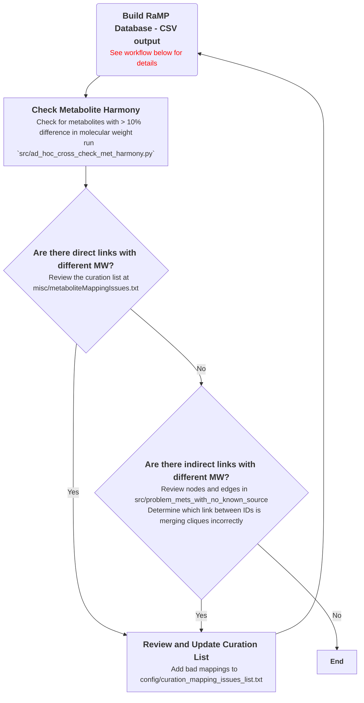
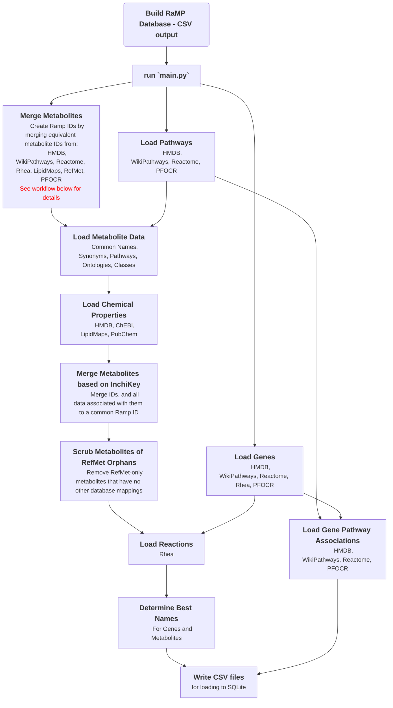
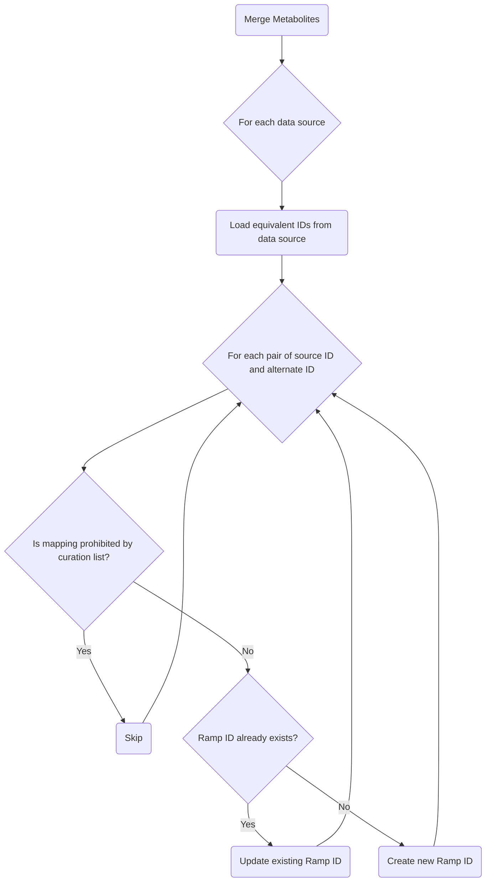

```mermaid
graph TD
    Build_RaMP_DB(
        <b style="font-size:larger">Build RaMP Database - CSV output</b>
<span style="color:red">See workflow below for details</span>
    )
    Check_Harmonization[
    <b style="font-size:larger">Check Metabolite Harmony</b>
    Check for metabolites with > 10% difference in molecular weight
    run `src/ad_hoc_cross_check_met_harmony.py`
    ]
    Direct_Mismatched_MW{
    <b style="font-size:larger">Are there direct links with different MW?</b>
    Review the curation list at misc/metaboliteMappingIssues.txt
    }
    Indirect_Mismatched_MW{
    <b style="font-size:larger">Are there indirect links with different MW?</b>
    Review nodes and edges in src/problem_mets_with_no_known_source
    Determine which link between IDs is merging cliques incorrectly
    }
    
    Direct_Mismatched_MW -->|No|Indirect_Mismatched_MW
    Direct_Mismatched_MW -->|Yes|Review_and_Update_Curation_List
    
    Review_and_Update_Curation_List[
    <b style="font-size:larger">Review and Update Curation List</b>
    Add bad mappings to config/curation_mapping_issues_list.txt
    ]
    Indirect_Mismatched_MW -->|Yes|Review_and_Update_Curation_List
    Indirect_Mismatched_MW --> |No|End[<b style="font-size:
    larger">End</b>]
    Build_RaMP_DB --> Check_Harmonization
    Check_Harmonization --> Direct_Mismatched_MW
    
    Review_and_Update_Curation_List --> Build_RaMP_DB
```

```mermaid
graph TD
    Download_Data(
        <b style="font-size:larger">Build RaMP Database - CSV output</b>
    )
    mainpy[
<b style="font-size:larger">run `main.py`</b>
    ]
    Load_Pathways[
        <b style="font-size:larger">Load Pathways</b>
        HMDB, WikiPathways, Reactome, PFOCR
    ]
    Load_Genes[
        <b style="font-size:larger">Load Genes</b>
        HMDB, WikiPathways, Reactome, Rhea, PFOCR
    ]
    Link_Genes_Pathways[
        <b style="font-size:larger">Load Gene Pathway Associations</b>
        HMDB, WikiPathways, Reactome, PFOCR
    ]
    Merge_Metabolites[
        <b style="font-size:larger">Merge Metabolites</b>
        Create Ramp IDs by merging equivalent metabolite IDs from:
        HMDB, WikiPathways, Reactome, Rhea, LipidMaps, RefMet, PFOCR
<span style="color:red">See workflow below for details</span>
    ]
    Load_Metabolite_Data[
        <b style="font-size:larger">Load Metabolite Data</b>
        Common Names, Synonyms, Pathways, Ontologies, Classes
    ]
    Load_Chem_Props[
        <b style="font-size:larger">Load Chemical Properties</b>
        HMDB, ChEBI, LipidMaps, PubChem
    ]
    Merge_Metabolites_Inchikey[
        <b style="font-size:larger">Merge Metabolites based on InchiKey</b>
        Merge IDs, and all data associated with them to a common Ramp ID
    ]
    Scrub_Metabolites_of_RefMet_Orphans[
        <b style="font-size:larger">Scrub Metabolites of RefMet Orphans</b>
        Remove RefMet-only metabolites that have no other database mappings
    ]
    Load_Reactions[
        <b style="font-size:larger">Load Reactions</b>
        Rhea
    ]
    Best_Names[
        <b style="font-size:larger">Determine Best Names</b>
        For Genes and Metabolites
    ]
    Write_SQL_CSV_files[
        <b style="font-size:larger">Write CSV files</b>
        for loading to SQLite
    ]
    Download_Data --> mainpy
    mainpy --> Load_Pathways
    mainpy --> Load_Genes
    Load_Pathways --> Link_Genes_Pathways
    Load_Genes --> Link_Genes_Pathways
    mainpy --> Merge_Metabolites
    Merge_Metabolites --> Load_Metabolite_Data
Load_Pathways --> Load_Metabolite_Data
    Load_Metabolite_Data --> Load_Chem_Props
    Load_Chem_Props --> Merge_Metabolites_Inchikey
    Merge_Metabolites_Inchikey --> Scrub_Metabolites_of_RefMet_Orphans
    Scrub_Metabolites_of_RefMet_Orphans --> Load_Reactions
    Load_Genes --> Load_Reactions
    Load_Reactions --> Best_Names
    Best_Names --> Write_SQL_CSV_files
    Link_Genes_Pathways --> Write_SQL_CSV_files
%%    Download_PubChem[
%%        <b style="font-size:larger">Download PubChem Data</b>
%%        this adds new info to misc/data/chemprops/pubchem/cid_to_mw.tsv
%%        run `ad_hoc_download_pubchem_mol_info.py`
%%        ]

```

```mermaid
flowchart TD
    Start_Merge(Merge Metabolites) -->  DS_Loop{For each data source}
    DS_Loop --> Load_IDs(Load equivalent IDs from data source)

    Load_IDs --> ID_Loop{For each pair of source ID and alternate ID}

    ID_Loop --> BadMap{Is mapping prohibited by curation list?}
    BadMap -->|Yes| Skip(Skip)
    Skip --> ID_Loop
    ID_exists{Ramp ID already exists?} -->|Yes| Merge_ID(Update existing Ramp ID)
    ID_exists -->|No| Create_ID(Create new Ramp ID)
    BadMap -->|No| ID_exists
    Create_ID --> ID_Loop
    Merge_ID --> ID_Loop
```